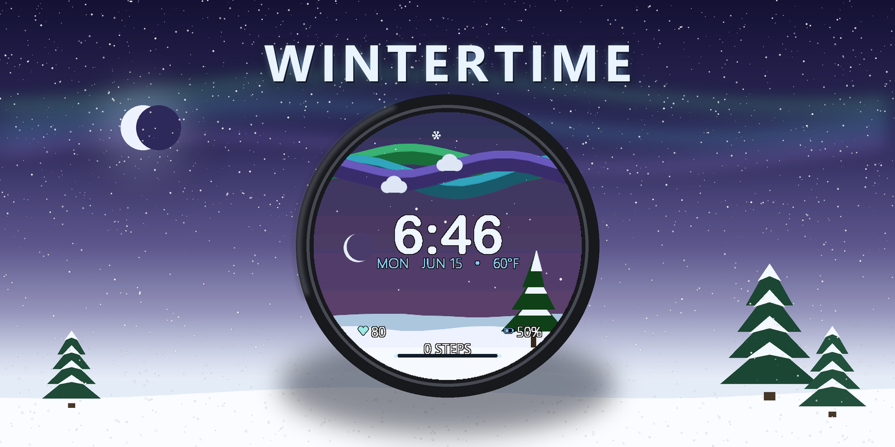
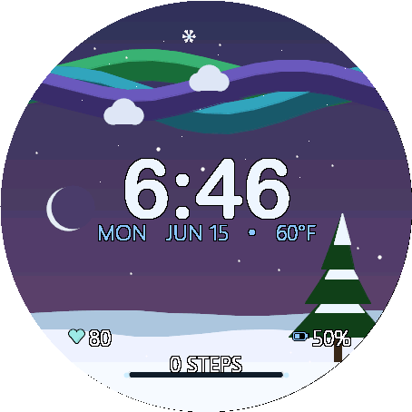

# Snowfall Watch Face



A premium, winter alpine themed **digital watch face** for **Garmin** watches, written in Monkey C for Connect IQ. Originally built for the **Fenix 8 / tactix 8**, it now runs on every Connect IQ 4.0+ round watch (see [Hardware / scaling](#hardware--scaling)).

<p align="center">
  
</p>

Snowfall brings a crisp, serene, and beautiful winter aesthetic to your watch:
 
- **Living Winter Sky Backdrop**: A smooth color gradient shifting through deep indigo night, cold rose dawn, pale midday blue, a brief cold-peach sunset, and twilight purple based on the current hour.
- **Aurora & Stars at Night**: Wavy ribbons of green, cyan, and violet aurora borealis drift above a field of stars on the long winter nights.
- **Arcing Celestial Objects**: A pale winter sun (with faint rotating rays and a cold halo) and a silver crescent moon rise and set along a circular path, driven by the **real sunrise/sunset** computed from the watch's location and today's date (falls back to a fixed winter schedule when no location fix is available). The sky, day/night, and aurora all follow the same real sun times.
- **Drifting Snow Clouds & Rolling Drifts**: Soft clouds drift across the sky, and overlapping snow-drift layers roll gently at the bottom with real-time motion in active mode.
- **Snow-laden Pine Silhouette**: A tiered evergreen with snow caps sways in the breeze at the snowbank.
- **Falling Snow**: Gentle snowflakes drift down across the whole face in active mode.
- **Festive Mode** *(one toggle, on by default)*: Holiday magic on demand. Santa's sleigh and two reindeer — the lead one with Rudolph's glowing red nose — sweep across the sky on a timed flyover every ~2.5 minutes, trailing stardust. The pine tree lights up with garlands of blinking multicolor lights and a twinkling, pulsing five-point star topper, and a radiant **Star of Bethlehem** joins the night sky. Switch it off for the pure alpine look.
- **Winter Critters** *(one toggle, on by default)*: Occasional little visitors cross the scene — at most one at a time, every ~40s, computed purely from the clock. By day a **red cardinal** flies the sky, a **snowshoe hare** bounds across the snow, a **red fox** trots and snow-pounces, and a **chickadee** glides in to peck before flitting off. By night a **snowy owl** glides overhead, an **arctic fox** trots past, a **grey wolf** pauses to howl, and an antlered **stag** walks by with breath steaming. Sky visitors are drawn in the sky; ground visitors walk on the snow. Critters never render in always-on, so they cost nothing on the burn-in budget.
- **Snowflake Seconds**: A six-armed snowflake second indicator orbits the outer perimeter (drawn on top of everything, and only while the watch is active).
- **Centered Digital Time**: Large, clean, rounded clock numerals (Arial Rounded MT Bold) centered with high-contrast black outlining.
- **Centered Date & Weather**: An elegant date line (Segoe UI Light) showing the calendar date and dynamic weather temperature (with automatic Celsius/Fahrenheit unit conversion).
- **Configurable Complications**: The bottom-left and bottom-right complications are each chosen in the app settings, and the watch draws a matching icon:
  - **❤ Heart Rate** (icy-mint heart) — live BPM, sampled at most once every ~10s to spare the battery.
  - **⚡ Body Battery** (teal bolt) — Garmin's 0–100 energy score.
  - **🔋 Device Battery** (glacier-blue battery with a live fill bar) — the watch's charge.
  - **👣 Steps** (frost boot) — today's step count.
  - **🔥 Calories** (ember flame) — today's calories.
  - **Off** — hide the complication.
  - Defaults: left = Heart Rate, right = Device Battery.
  - **Bottom-center**: A steps progress bar (frosted ice themed) + steps numeric count, always shown.
- **High-Contrast Text Outlines**: All text elements (clock, date, and metrics) are drawn with a custom black outline to ensure legibility against any dynamic gradient or snow background.

## Hardware / scaling

Originally built for the tactix 8 / Fenix 8, Snowfall now targets **every Connect IQ 4.0+ round watch that supports watch faces**. The full product list lives in [manifest.xml](manifest.xml); the families covered are:

- **Forerunner** — 165, 255 (incl. S/Music), 265 / 265S, 570, 955, **965**, **970**
- **fenix / epix / enduro** — fenix 7 (S/X, Pro), fenix 8 (AMOLED + Solar), fenix E, epix 2 / Pro (42/47/51mm), enduro 3
- **Venu / Vivoactive** — Venu 2 / 2S / 2 Plus, Venu 3 / 3S, Venu 4 (41/45mm), Vivoactive 5 / 6
- **Instinct** — Instinct 3 (AMOLED 45/50mm, Solar 45mm), Instinct E (40/45mm), Instinct Crossover (AMOLED)
- **Specialty** — Approach S50 / S70 (golf), Descent G2 / Mk3 (dive), D2 Air X10 / Mach 1 / Mach 2 (aviation), MARQ 2 / Aviator

Edge bike computers and handheld GPS units are excluded (not watches), and the **square/rectangular panels (Venu Sq 2, Venu X1) are excluded too** — the circular layout is designed for round screens.

### How it scales

Everything is laid out in percentages of `dc.getWidth()/getHeight()` and the screen center, so the same source renders across every panel. Because bitmap fonts don't scale, [tools/gen_fonts.py](tools/gen_fonts.py) bakes a correctly-sized font set for each distinct resolution and [monkey.jungle](monkey.jungle) maps every product to the right one:

| Resolution | Set                          | Example devices |
|------------|------------------------------|-----------------|
| 454×454    | `resources/` (base)          | Fenix 8 47/51mm, FR965/970, Venu 3, epix 2 Pro 51mm |
| 416×416    | `resources-round-416x416/`   | Fenix 8 43mm, FR265, epix 2, Venu 2 |
| 390×390    | `resources-round-390x390/`   | FR165, Venu 3S, Vivoactive 5/6, Instinct 3 AMOLED 45mm |
| 360×360    | `resources-round-360x360/`   | FR265S, Venu 2S |
| 280×280    | `resources-round-280x280/`   | Fenix 7X, Fenix 8 Solar 51mm, enduro 3 |
| 260×260    | `resources-round-260x260/`   | FR255/955, Fenix 7, Fenix 8 Solar 47mm |
| 240×240    | `resources-round-240x240/`   | Fenix 7S |
| 218×218    | `resources-round-218x218/`   | FR255S |
| 176×176    | `resources-round-176x176/`   | Instinct 3 Solar 45mm, Instinct E 45mm |
| 166×166    | `resources-round-166x166/`   | Instinct E 40mm |

Re-run `python tools/gen_fonts.py` after changing font sizes or adding a new resolution. Fonts scale by `min(width, height)` so they fit the shorter axis on rectangular panels.

## Always-on display

The face has two render paths sharing one `onUpdate()`:

- **Active mode** — full brightness, animations (snow drifts, swaying pine, sun rotation, falling snow, drifting clouds, aurora), sky gradients, and text outlines.
- **Always-on / low-power** (`mIsSleep`) — burn-in-safe: dim grey time/date, thin outline representations of the battery metrics, steps progress outline, and **no visual fills or background animations**. All lit pixels are shifted a few pixels each minute (`requiresBurnInProtection`). `onPartialUpdate()` only repaints when the minute changes, and on AMOLED always-on it **clips to just the central time/date band** rather than re-rendering the whole screen — staying well inside the partial-update budget. (MIP panels, whose sleep frame is the full colour scene, keep the full redraw.)

### Performance & stability

Snowfall is tuned to keep animating smoothly on everything from a 166px Instinct to a 454px flagship without tripping Garmin's per-frame execution/power budget (the usual cause of a watch face "freezing"):

- **Adaptive render quality** — `onUpdate()` times its own frame and nudges a quality level (0–3) with hysteresis. Expensive detail (text-outline passes, sun rays, aurora ribbons, falling-snow count) scales with it, so the scene keeps fully animating and only sheds detail on hardware that can't keep up — auto-fitting each device with no per-device guessing.
- **Cached per-frame syscalls** — device settings, clock, and activity info are read once per redraw and reused; sunrise/sunset retries are throttled while no fix is available.
- **No per-frame heap churn** — star field, sky-gradient tables, and the drift/aurora polygon buffers are hoisted/reused; on AMOLED the sky gradient is rendered once into a `BufferedBitmap` and blitted, repainting in place only when the colors change.
- **Loop-safe math** — angle/hour normalizers use bounded modulo with a non-finite guard (no unbounded `while`), and `%`-based wraps use positive modulo.

## Data sources

- **Steps + goal:** `ActivityMonitor.getInfo()` (`steps`, `stepGoal`).
- **Calories:** `ActivityMonitor.getInfo().calories`.
- **Heart rate:** `Activity.getActivityInfo().currentHeartRate` (with an `ActivityMonitor.getHeartRateHistory` fallback), cached and refreshed at most once every ~10s.
- **Device battery:** `System.getSystemStats().battery`.
- **Body Battery:** `SensorHistory.getBodyBatteryHistory()`. Fails gracefully if the value is unavailable.
- **Weather:** `Weather.getCurrentConditions()` (uses Connect IQ weather APIs to display current temperature in Celsius or Fahrenheit depending on device settings).
- **Location & sun times:** last-known location from `Activity.getActivityInfo().currentLocation` (or the weather observation location — neither powers up GPS); sunrise/sunset are computed locally with a standard NOAA almanac formula and cached per day.

## Settings

Editable in Garmin Connect / the simulator's App Settings:

- **Show Date** — toggle the date and weather line.
- **Festive Mode** — toggle the holiday extras: Santa's sleigh flyover, the lit/sparkling Christmas tree, and the Star of Bethlehem.
- **Winter Critters** — toggle the occasional crossing visitors (fox, hare, cardinal, chickadee, owl, arctic fox, wolf, stag).
- **Step Goal Override** — steps for a full progress bar; `0` uses the watch's own step goal.
- **Bottom-Left Complication** — Off / Heart Rate / Body Battery / Device Battery / Steps / Calories.
- **Bottom-Right Complication** — same options (each shows an emoji in the phone picker and a matching icon on the watch).

## Build & run

Prerequisites: the **Connect IQ SDK** and a JDK. Paths live in `build_config.json` (auto-created on first run) — edit them to match your machine:

```json
{
  "JavaHome": "C:\\Program Files\\Android\\openjdk\\jdk-21.0.8",
  "SdkDir":   "C:\\Users\\<you>\\AppData\\Roaming\\Garmin\\ConnectIQ\\Sdks\\<sdk-version>"
}
```

### Build (default device = `fenix847mm`, 454×454)

```powershell
./build.ps1                     # build .prg
./build.ps1 -Device fenix843mm  # build the 416×416 variant
./build.ps1 -Export             # package a store-ready .iq
```

### Build + launch in the simulator

```powershell
./build.ps1 -Run                # or double-click run_simulator.bat
```

In the simulator you can exercise the design via the menus:
- **Settings → Battery** to move the device-battery complication.
- **Simulation → Body Battery** for the Body Battery percentage.
- **Simulation → Time / Sleep** (Always On) to preview the low-power render path.
- **Simulation → Set Time** to test different hour transitions (dawn, pale noon, cold sunset, and the aurora-lit night).

### Sideload to the watch

1. Build the `.prg` (or `.iq`).
2. Connect the watch by USB; it mounts as a drive.
3. Copy `bin/Snowfall.prg` to `GARMIN/APPS/` on the device.
4. Eject and select **Snowfall** from the watch face list.

For store distribution, upload the `.iq` from `./build.ps1 -Export`.

## Fonts & Typography

The face renders using custom rasterized bitmap fonts:

- **Time font**: *Arial Rounded MT Bold* (`exocet_time.fnt`/`.png`).
- **Date / Metrics font**: *Segoe UI Light* (`exocet_label.fnt`/`.png`).

The bitmap font pipeline is:

```
fonts-src/RoundedTime.ttf  ──┐
fonts-src/SegoeUILight.ttf ──┤  python tools/gen_fonts.py
                             └─▶  resources/fonts/exocet_*.fnt + .png
```

- `tools/gen_fonts.py` rasterizes the glyphs we use (digits, symbols like `:` and `%`, and standard letters) into alpha atlases so `dc.setColor()` tints them. Re-run it if you need to modify font sizes or support new characters.
- `resources/fonts/fonts.xml` declares `ExocetTime` / `ExocetValue` / `ExocetLabel`.
- `initFonts()` loads them, falling back to vector fonts then built-ins if missing.

## Customizing

- **Colors / palettes**: drift, pine, cloud, aurora, and sky gradient palettes are constants and function calculations inside `SnowfallView.mc`.
- **Layout anchors**: all coordinate scales are relative percentage values in `onUpdate()`.
